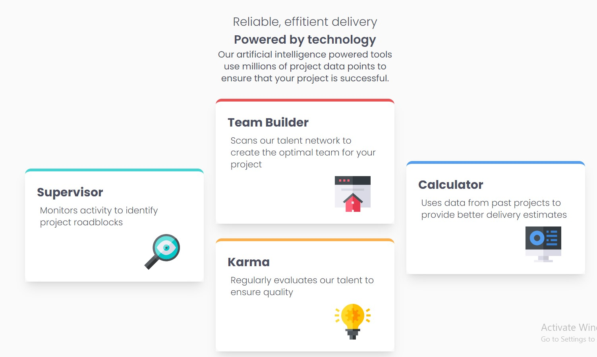

# Frontend Mentor - Four card feature section solution

This is a solution to the [Four card feature section challenge on Frontend Mentor](https://www.frontendmentor.io/challenges/four-card-feature-section-weK1eFYK). 

## Overview
### The challenge

Users should be able to:

- View the optimal layout for the site depending on their device's screen size

### Screenshot

### Links

- Solution URL: https://esnima.github.io/four-card-feature/

## My process

### Built with

- React.js
- Tailwind

### What I learned
I tried Flexbox on Tailwind for the first time. That was fun. 

## Author
Nima Mahmoodian
-LinkedIn: www.linkedin.com/in/nima-mahmoodian

